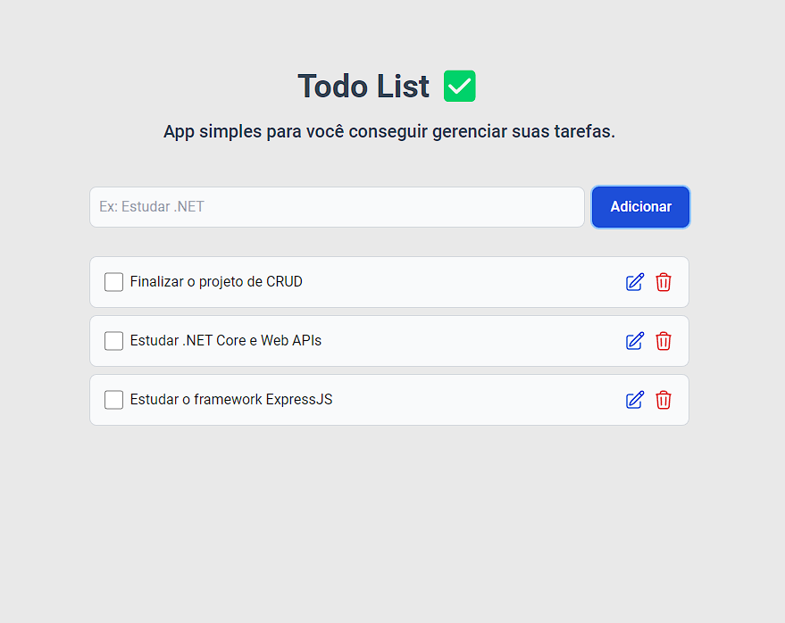

# Web Server NodeJS

Esse projeto é referente a matéria de Tecnologia Web e consiste de uma aplicação Web de todo-list simples utilizando NodeJS.

  

## Techs utilizadas

- NodeJS 
- Typescript
- [ExpressJS](https://expressjs.com/) - Framework web famoso no ecossistema Javascript
- [TailwindCSS](https://tailwindcss.com/) - Framework CSS que possui uma abordagem utility-first